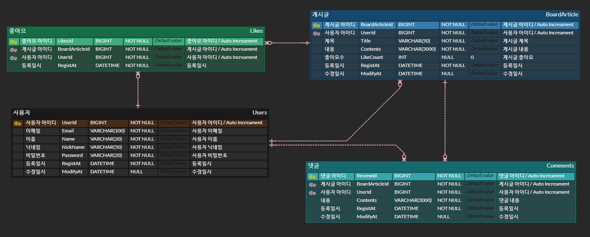

# 📝community 게시판 만들기
사용자간 간단히 소통할 수 있는 게시판 서비스

# 🛠️기술 & 툴
- Java
- Spring Boot (gradle)
- Spring Web, JPA, Lombok, JWT, h2 Database

# 🗓️프로젝트 기간
2023-05-02 ~ 2023-06-05

# ERD

# 🧰주요 기능
## 🧲회원가입
- 사용자는 회원가입을 진행한다.
- 회원가입 진행 시 이메일과 비밀번호 등 입력받는다.
- [x] 회원가입 기능

## 🚪로그인
- 사용자는 로그인을 진행한다.
- 회원가입 시 입력한 이메일과 비밀번호가 일치해야한다.
- [x] 로그인 기능

## 📝게시글
### 게시글 등록
- 로그인 후 게시글 작성이 가능하다.
- 게시글 작성 시 제목, 내용을 작성할 수 있다.
- [x] 게시글 등록 기능

### 게시글 조회
- 게시글 조회는 로그인 관계없이 조회 할 수 있다.
- 게시글 제목, 작성자, 작성일, 좋아요 횟수 항목이 나타나며, 최신순/좋아요가 많은 순으로 조회할 수 있다.
- 최신순/좋아요순 정렬 기능은 별도로 인덱스를 생성해 구현한다.
- [x] 게시글 조회 기능
- [ ] 최신순/좋아요가 많은 순으로 조회

### 해당 게시글 읽기 (= 들어가기)
- 로그인 후 게시글 읽기가 가능하다.
- [x] 게시글 읽기 기능

### 댓글 목록 조회
- 해당 게시글을 읽었을 때 댓글 목록이 조회된다.
- [x] 댓글 목록 조회 기능

### 댓글 작성
- 해당 게시글을 들어갔을 때 댓글을 작성 할 수 있다.
- [x] 댓글 등록 기능

### 좋아요 버튼
- 해당 게시글을 들어갔을 때 좋아요 버튼을 눌러 갯수를 증가 또는 감소시킬 수 있다.
- 좋아요 버튼을 누를 시 좋아요 추가, 테이블에 INSERT 한다.
- 다시 한번 누를시 좋아요 취소에 해당, 테이블에 DELETE 를 한다.
- [x] 좋아요 기능
- [ ] 좋아요 취소 기능
